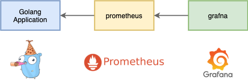

# stats

**stats base on golang prometheus client**

* essy api
* support gin middleware, fix dymamic params in url



### methods

**http**

* SetHttpReqStats
* SetHttpReqStatsWrap

**func**

* NewFuncDurationStats
* SetFuncDurationStatsWrap
* SetFuncDurationStats

**database**

* NewDatabaseDurationStats
* SetDatabaseDurationStats
* SetDatabaseDurationStatsWrap

[`more...`](stats.go)

### gin usage:

**metrics**

* metric:http_request_duration_seconds
* metric:http_request_total
* metric:http_response_bytes
* metric:http_request_bytes

**how to use in gin web frame ?**

```
router := gin.Default()

// add gin metric middleware
router.Use(stats.GinMetricMiddleware())

router.GET("/metrics", gin.WrapH(promhttp.Handler()))
router.Run(":80")
```

### example usage:

func NewDatabaseDurationStats(dao string, filter string, args []interface{}) func()

```go
func() {
    var (
        dao = "user"
        filter = "queryUserByIds"
    )

    done := NewDatabaseDurationStats(dao, filter, []string{"admin"})

    time.Sleep(1e6)
    time.Sleep(1e6)
    time.Sleep(1e6)

    done()
}
```

func SetDatabaseDurationStats(dao string, filter string, args []interface{}, start time.Time)

```go
func() {
    var (
        dao = "user"
        filter = "queryUserByIds"
        start = time.Now()
    )

    time.Sleep(1e6)
    time.Sleep(1e6)
    time.Sleep(1e6)

    SetDatabaseDurationStats(dao, filter, nil, start)
}
```

func SetDatabaseDurationStatsWrap(dao string, filter string, args []interface{}) func()

```go
func() {
    var (
        dao = "user"
        filter = "queryUserByIds"
    )

    defer SetDatabaseDurationStatsWrap(dao, filter, nil)()

    time.Sleep(1e6)
    time.Sleep(1e6)
    time.Sleep(1e6)
}
```
